# AC3.2-Tableviews Part 4: **Segues**

---
### Readings

 1. [General Reference on Xcode (very useful)](http://help.apple.com/xcode/mac/8.0)
 2. [Configuring a Segue in Storyboard - Apple](http://help.apple.com/xcode/mac/8.0/#/deve5fc2eb19)
 3. [Using Segues (lots of great info here)](https://developer.apple.com/library/content/featuredarticles/ViewControllerPGforiPhoneOS/UsingSegues.html)
 4. [Navigation Controller Implementation - tuts+ (helpful reference and example)](https://code.tutsplus.com/tutorials/ios-from-scratch-with-swift-navigation-controllers-and-view-controller-hierarchies--cms-25462)

#### References

1. [Using Segues - Apple](https://developer.apple.com/library/content/featuredarticles/ViewControllerPGforiPhoneOS/UsingSegues.html)
2. [`prepare(for:sender:)` - Apple](https://developer.apple.com/reference/appkit/nssegueperforming/1409583-performsegue)

---
### Vocabulary

1. **MVP (Minimum Viable Product)** - rapidly building a minimum set of features that is enough to deploy a product and test key assumptions about customers’ interactions with the product. [Quora](https://www.quora.com/What-is-a-minimum-viable-product/answer/Suren-Samarchyan?srid=dpgi)
2. **Segue** - A segue defines a transition between two view controllers in your app’s storyboard file. [Apple](https://developer.apple.com/library/content/featuredarticles/ViewControllerPGforiPhoneOS/UsingSegues.html)

---
### 0. Objectives

1. Understand segues in storyboard to transition between view controllers
2. Futher our understanding of `UITableViewController` delegate functions
3. Create a new custom `UIViewController` to display a single `Movie` object's data

---

### 1. Revealing the MVP to Reel Good

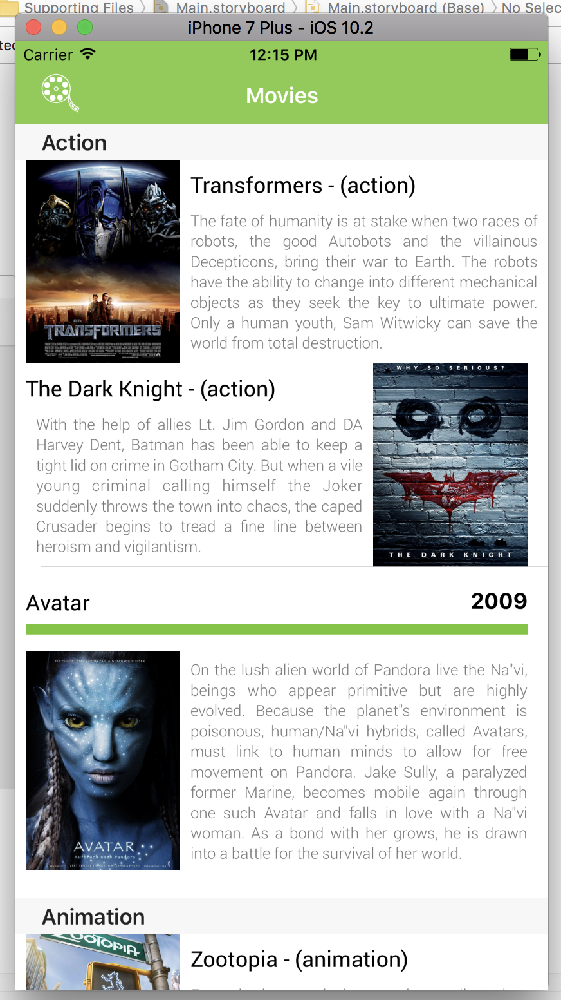

"Stunning!" - Reelgood, CEO

"Looks like it could use a little UI work, but definitely an interesting discovery!" - Reelgood, Lead Designer

"How much is this costing us?" - Reelgood, CFO

"The board will be thrilled" - Reelgood, Investor Relations

"It's OK." - Reelgood, Crusty iOS Engineer

"WHAT." - Reelgood, Web Engineer

Great work on this MVP, but now Reel Good is expecting a lot more out of the next iteration. They want a full screen detail view on the movie and some design tweaks. On top of this, your engineering team has decided that the code base needs some clean up before it gets to large! The next stage of this project will be even more challenging and there's no time to rest on laurels.

Reel Good took our latest prototype and presented it to their board of investors as the cornerstone of their mobile initiative. The extra work we put behind the design of the app must have really sold it, because Reel Good now needs one more set of changes before they take the app into beta.

For the next [MVP](https://www.quora.com/What-is-a-minimum-viable-product/answer/Suren-Samarchyan?srid=dpgi), Reel Good wants to be able to tap on the movie cell to display full details of the movie on a different screen.

#### Planning

After the meeting with Reel Good, we sat down with our engineering team and sketched out the necessary requirements of this next task and broke them down:

1. We have to create a new view controller to present a full screen version of the movie data
2. We need to make sure that navigation works to go to and from one of these view controllers.
3. The proper movie data has to be transferred from one view controller to the next, so we need to do some data handling

> Developer's note: A huge part of development is being able to translate feature requests from clients into actual programming work. Taking some time to plan out a course of action before starting to code will likely save you a lot of time in the course of your project. Though even with the best planning, there absolutely will be unforseen problems that you will encounter. But that's just part of the fun of programming.

---
### 1. Adding a new `UIViewController` to Display a single `Movie`

#### Storyboard Changes **(Use iPhone 6s for your simulation)**
1. Drag in a `UIViewController` into `Main.storyboard` from the *Objects Library* in the *Utilities Pane* and place it next to the `MovieTableViewController`
  - 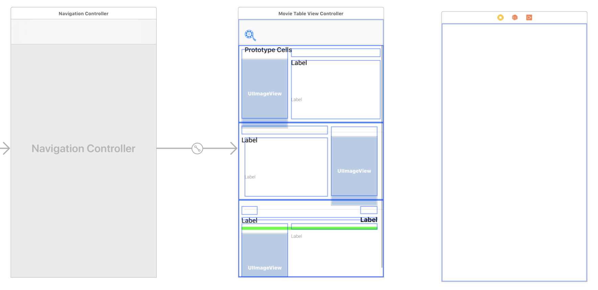
2. Select the `MovieTableViewCell` prototype cell (make sure you have the actual `cell` selected and not one of its subviews) and `ctrl`-Drag to the new `UIViewController`
3. On the outlet menu that pops up, select "`Selection Segue > Show`"
  - 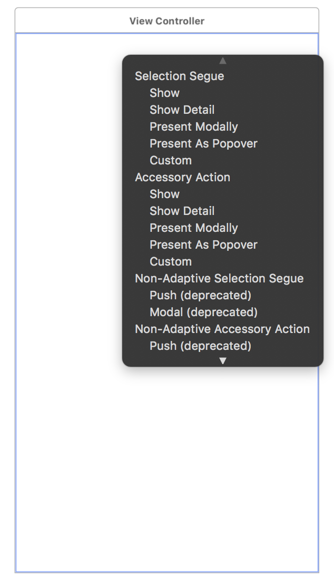
  - Note: "Accessory Selection" is the action to perform when adding an "accessory view." An example of an accessory view is the `>` (called a "chevron") you see all the way to the right on a cell in the Mail or Messages app on an iPhone.
  - The "Selection" type of segue refers to the action to take when the cell itself is tapped/selected.
  - 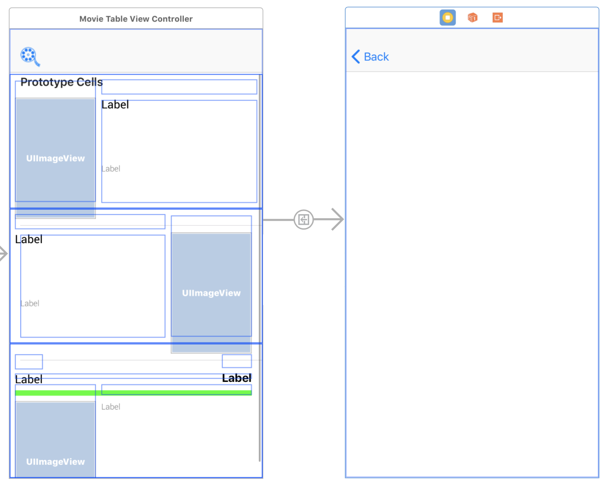
4. Select the segue object in storyboard (the -> arrow), and in the *Attribute Inspector*, set it's identifier to `MovieDetailViewSegue`
  - 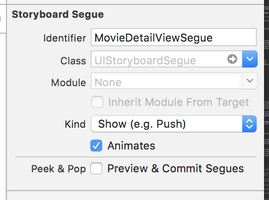
5. Drag in a `UIImageView` into the view controller, giving it the following attributes:
  - `8pt` margins at the top, left, and right
  - A height of `240pt`
  - _Before adding these constraints, make sure the checkmark box for "Constrain to margins" is selected_
  - Switch the image view's `Content Mode` to `Aspect Fit`
6. Drag in 4 `UILabel`s below the `UIImageView` in a vertical row
  - Label them (in order): `Genre`, `Location`, `Summary` and `Summary Text`
  - Set their fonts to `System - 17pt`, except for `Summary Text` which will be `System - Light - 14pt`
  - Set the number of lines for `Summary Text` to 0
7. Select **all** of the `UILabel`s at once, by holding down the Command (⌘) Key while clicking on them
  - Select *Pin* and set it to **8pt margins**, also making sure that the checkmark for "Constrain to margins" is selected
  - Set the `Vertical Content Hugging Priority` to 1000 for all labels except `Summary Text`. Instead, set the *Vertical Compression Resistance* of `Summary Text` to 1000
8. Your view controller should resemble:

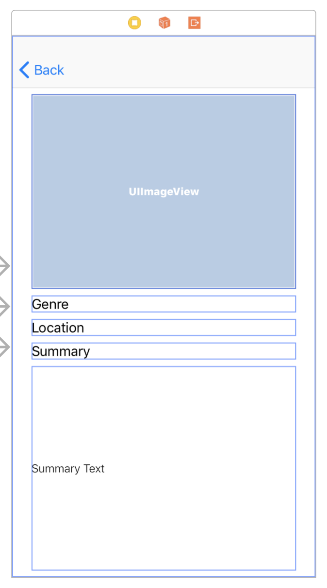

Being able to set constraints in this batching form is one of the nice advantages of using storyboards.

<details><summary>Q1: Can you explain the reason behind giving <code>genreLabel, locationLabel, summaryLabel</code> a vertical hugging priority of <code>1000(Required)</code>, but not <code>summaryFullTextLabel</code>?</summary>
<br>
<br>

<code>summaryFullTextLabel</code> had its <code>numberOfLines</code> property changed to 0, meaning that it can have unlimited lines of text. The other labels will only have one. So we know that the vertical space needed for the first three labels will always be constant -- meaning that we want the bounds of the label to hug the text as much as possible so as to prevent expanding vertically (not that it would in this case, since the numberOfLines for them is 1). This is in constract to the <code>summaryFullTextLabel</code>, which we want to expand as much as needed to accomodate multiple lines of text. So setting a low vertical hugging priority allows it to expand as much as it needs to vertically.

<br>
</details>
<br>

#### Storyboard linking
1. Add a new file named `MovieDetailViewController` that subclasses `UIViewController` and place it in the correct folder and Xcode group
2. In `Main.storyboard` change the custom class of the view controller we just added to be `MovieDetailViewController`
3. Create outlets for each of the labels and the imageView. Name them:
  - `moviePosterImageView`, `genreLabel`, `locationLabel`, `summaryLabel`, and `summaryFullTextLabel`
4. Additionally, give `MovieDetailViewController` an instance variable of type `Movie`
  - `var selectedMovie: Movie!`
  - This property will hold a reference to the `Movie` from the cell that was tapped.

Your code in `MovieDetailViewController` should look like this:

```swift
class MovieDetailViewController: UIViewController {
  @IBOutlet weak var moviePosterImageView: UIImageView!
  @IBOutlet weak var genreLabel: UILabel!
  @IBOutlet weak var locationLabel: UILabel!
  @IBOutlet weak var summaryFullTextLabel: UILabel!
  @IBOutlet weak var summaryLabel: UILabel!

  var selectedMovie: Movie!
  override func viewDidLoad() {
        super.viewDidLoad()

        // Do any additional setup after loading the view.
    }

    override func didReceiveMemoryWarning() {
        super.didReceiveMemoryWarning()
        // Dispose of any resources that can be recreated.
    }
}
```

<details><summary>Q1: Why do we add the force unwrapped <code>!</code> to the <code>selectedMovie</code> property?</summary>
<br>
<br>
By adding the <code>!</code>, we're guaranteeing the Swift compiler that by the time this property is used, it will not be nil. If we didn't include <code>!</code>, we'd have to either give <code>selectedProperty</code> a default value or write an initializer that would give it a default value.
<br><br>
If you follow this pattern, you want to be absolutely sure that you give properties a value before using them, otherwise you will cause your app to crash!
<br>
</details>
<br>

#### Preparing for Segue
A `UINavigationController` is unique in that it manages a _navigation stack_, which is a hierarchy of view controllers that are essentially stacked on top of each other.

You can think of each view controller as being a card in a stack of cards.  When you **push** a view controller onto the stack, you're putting a new card on top of the _stack_ of cards. That top-most card is what is currently visible on screen. When you **pop** a view controller, you're taking a card off the top of the _stack_, and revealing the card/view controller just below it.

> Developer Note: It's important to know that all view controllers currently on the stack can be accessed through the navigation controller

The `prepare(for:sender:)` method is where we get things ready for displaying a new view controller that has been set up in storyboard.

As mentioned in the documentation for [`prepare(for:sender:)`](https://developer.apple.com/reference/appkit/nssegueperforming/1409583-performsegue), the `sender` parameter refers to the object that has requested the segue. In our case, the `sender` is expected to be a `MovieTableviewCell` (since that's the connection we made earlier in `ctrl`-dragging our prototype cell to the new `MovieDetailViewController`). But because the `sender` is defined as being of type `Any?`, we should do a check to confirm our assumptions. Moreover, we'll need the cell to determine which movie cell was tapped.

```swift
  // ~~~ MovieTableViewController ~~~
  override func prepare(for segue: UIStoryboardSegue, sender: Any?) {

    // 1. We need to check what our sender is. Afterall, there might be multiple segues set up...
    if let tappedMovieCell: MovieTableViewCell = sender as? MovieTableViewCell {

    }
  }
```

The `segue` object is an instance of [`UIStoryboardSegue`](https://developer.apple.com/reference/uikit/uistoryboardsegue), which has an instance property of `indentifier` that refers to the identifier string we gave to the segue earlier in `Main.storyboard` (we used `MovieDetailViewSegue`). In order to make sure that we have the correct segue (a storyboard can have many segues), we need to check that the identifier matches one that we expect:

```swift
  // ~~~ MovieTableViewController ~~~
  override func prepare(for segue: UIStoryboardSegue, sender: Any?) {

    // 1. We need to check what our sender is. Afterall, there might be multiple segues set up...
    if let tappedMovieCell: MovieTableViewCell = sender as? MovieTableViewCell {

      // 2. check for the right storyboard segue
      if segue.identifier == "MovieDetailViewSegue" {

      }
    }
  }
```

Taking another look at the `UIStoryboardSegue` documentation, we see that there is a property called `destination: UIViewController` which references the view controller that will be pushed onto the navigation stack. We need to cast it as a `MovieDetailViewController` since we know that the segue we're getting ready for is going to push to one.


```swift
// ~~~ MovieTableViewController ~~~
override func prepare(for segue: UIStoryboardSegue, sender: Any?) {
    // 1. We need to check what our sender is. Afterall, there might be multiple segues set up...
    if let tappedMovieCell: MovieTableViewCell = sender as? MovieTableViewCell {
      // 2. check for the right storyboard segue
      if segue.identifier == "MovieDetailViewSegue" {

        // 3. Get the destination VC
        let movieDetailViewController: MovieDetailViewController = segue.destination as! MovieDetailViewController


      }
    }
  }
```

While generally you should avoid force unwrapping, because we're certain of both the `sender` being `MovieTableViewCell` and the storyboard `seguesegue.identifier` being `MovieDetailViewSegue` we can say with some certainty that the next piece to the puzzle, `segue.destination`, is going to be a `MovieDetailViewController`.

We now have the tapped cell (`sender`) and the instance of `MovieDetailViewController` (`segue.destination`), but how do we get the `Movie` object that corresponds to the cell we selected?

We already wrote a piece of code in `cellForRow` that arranged our `movieData` by genre, but that required having the current `indexPath`. Fortunately, we can get that index path using a function of `UITableview` called `indexPath(for:)`. Using that function, along with our code from `cellForRow` we have:

```swift
// ~~~ MovieTableViewController ~~~
override func prepare(for segue: UIStoryboardSegue, sender: Any?) {
  // 1. check sender for the cell that was tapped
  if let tappedMovieCell: MovieTableViewCell = sender as? MovieTableViewCell {

    // 2. check for the right storyboard segue
    if segue.identifier == "MovieDetailViewSegue" {

      // 3. get reference to the destination view controller
      let movieDetailViewController: MovieDetailViewController = segue.destination as! MovieDetailViewController

      // 4. Getting the movie at the tapped cell
      let cellIndexPath = tableView.indexPath(for: tappedMovieCell)!

      // 5. Copy most of this code from cellForRow
      var cellMovie: Movie!
      if cellIndexPath.section == 0 {
        let actionMovies = self.filterMovies(for: .action)
        cellMovie = actionMovies[cellIndexPath.row]
      }
      else if cellIndexPath.section == 1 {
        let animatedMovies = self.filterMovies(for: .animation)
        cellMovie = animatedMovies[cellIndexPath.row]
      }
      else {
        let dramaticMovies = self.filterMovies(for: .drama)
        cellMovie = dramaticMovies[cellIndexPath.row]
      }

      // 6. set the destination MovieDetailViewController's selectedMovie property
      movieDetailViewController.selectedMovie = cellMovie
    }
  }
}
```

Now that the destination `MovieDetailViewController` has its `Movie` object reference, let's populate the labels:

```swift
// ~~~ MovieTableViewController ~~~
override func prepare(for segue: UIStoryboardSegue, sender: Any?) {
  // 1. We need to check what our sender is. Afterall, there might be multiple segues set up...
  if let tappedMovieCell: MovieTableViewCell = sender as? MovieTableViewCell {
    // 2. check for the right storyboard segue
    if segue.identifier == "MovieDetailViewSegue" {

      // 3. Get the destination VC
      let movieDetailViewController: MovieDetailViewController = segue.destination as! MovieDetailViewController

      // 4. Getting the movie at the tapped cell
      let cellIndexPath = tableView.indexPath(for: tappedMovieCell)!

      // 5. Copy most of this code from cellForRow
      var cellMovie: Movie!
      if cellIndexPath.section == 0 {
        let actionMovies = self.filterMovies(for: .action)
        cellMovie = actionMovies[cellIndexPath.row]
      }
      else if cellIndexPath.section == 1 {
        let animatedMovies = self.filterMovies(for: .animation)
        cellMovie = animatedMovies[cellIndexPath.row]
      }
      else {
        let dramaticMovies = self.filterMovies(for: .drama)
        cellMovie = dramaticMovies[cellIndexPath.row]
      }

      // 6. set the destination MovieDetailViewController's selectedMovie property
      movieDetailViewController.selectedMovie = cellMovie

      // 7. Set the properties of the MovieDetailViewController
      movieDetailViewController.moviePosterImageView.image = UIImage(named: cellMovie.poster)
      movieDetailViewController.genreLabel.text = "Genre: " + cellMovie.genre.capitalized
      movieDetailViewController.locationLabel.text = "Locations: " + cellMovie.locations.joined(separator: ", ")
      movieDetailViewController.summaryFullTextLabel.text = cellMovie.summary
    }
  }
}
```

Go ahead and run the poject at this point to see if the data gets passed along properly...

`fatal error: unexpectedly found nil while unwrapping an Optional value`

> **Discuss & Debug**: Why do you think we are getting force unwrapping errors?

#### Updating `MovieDetailViewController` with a `Movie`

Let's move our code to update property values of `MovieDetailViewController` into a new function in `MovieDetailViewController`, and let's call it `updateViews(for:)`:

```swift
  // ~~~ MovieDetailViewController ~~~
  func updateViews(for movie: Movie) {
    self.moviePosterImageView.image = UIImage(named: movie.poster)!
    self.genreLabel.text = "Genre: " + movie.genre.capitalized
    self.locationLabel.text = "Locations: " + movie.locations.joined(separator: ", ")
    self.summaryFullTextLabel.text = movie.summary
  }
```

Now, let's call `updateViews(for:)` in `viewDidLoad`

```swift
  // ~~~ MovieDetailViewController ~~~
  override func viewDidLoad() {
    super.viewDidLoad()
    self.updateViews(for: selectedMovie)
  }
```

And lastly, comment out the `selectedMovie` propery setting in `MovieTableViewController` so that your `prepare(for:sender:)` looks like:

```swift
// ~~~ MovieTableViewController ~~~
override func prepare(for segue: UIStoryboardSegue, sender: Any?) {
    // 1. We need to check what our sender is. Afterall, there might be multiple segues set up...
    if let tappedMovieCell: MovieTableViewCell = sender as? MovieTableViewCell {
      // 2. check for the right storyboard segue
      if segue.identifier == "MovieDetailViewSegue" {

        // 3. Get the destination VC
        let movieDetailViewController: MovieDetailViewController = segue.destination as! MovieDetailViewController

        // 4. Getting the movie at the tapped cell
        let cellIndexPath = tableView.indexPath(for: tappedMovieCell)!

        // 5. Copy most of this code from cellForRow
        var cellMovie: Movie!
        if cellIndexPath.section == 0 {
          let actionMovies = self.filterMovies(for: .action)
          cellMovie = actionMovies[cellIndexPath.row]
        }
        else if cellIndexPath.section == 1 {
          let animatedMovies = self.filterMovies(for: .animation)
          cellMovie = animatedMovies[cellIndexPath.row]
        }
        else {
          let dramaticMovies = self.filterMovies(for: .drama)
          cellMovie = dramaticMovies[cellIndexPath.row]
        }

        // 6. set the destination MovieDetailViewController's selectedMovie property
        movieDetailViewController.selectedMovie = cellMovie

        // 7. Set the properties of the MovieDetailViewController
//        movieDetailViewController.moviePosterImageView.image = UIImage(named: cellMovie.poster)
//        movieDetailViewController.genreLabel.text = "Genre: " + cellMovie.genre.capitalized
//        movieDetailViewController.locationLabel.text = "Locations: " + cellMovie.locations.joined(separator: ", ")
//        movieDetailViewController.summaryFullTextLabel.text = cellMovie.summary
      }
    }
  }
```

And re-run the project now. For all of your `MovieTableViewCells` that you tap on, you should see something similar to:

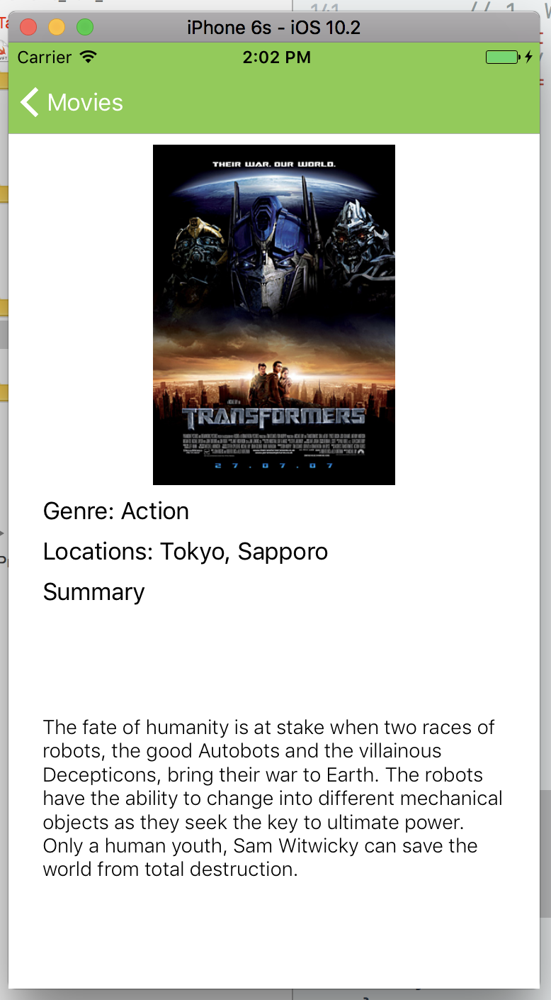

<br><br>
<details><summary>Q: So why were we getting force unwrapping errors before and not now?</summary>
<br><br>
In short: we can instantiate a new <code>MovieDetailViewController</code> in code to have a reference to it, but we're not guaranteed that its UI elements are actually non-nil until the view controller is actually loaded on screen. This means that we can't set property values on <code>IBOutlets</code> outside of the view controller's class if we created it in storyboard. This is why we needed to add another method to <code>MovieDetailViewController</code> to handle this update in <code>viewDidLoad</code>, the point at which we can guarantee that the entire view hierarchy is set up and available.
<br><br>
Tough question, but incredibly important to understand!
<br>
</details>
<br>

---

### 2. Exercises

> Note: There are no tests for these exercises

#### Warm Up: Adding A Title to the Navigation
Update the title of the `UINavigationController` of `MovieDetailViewController` to have the name of the `Movie` being viewed

#### Warm Up: More Segues!
It's great that we've got this working for `MovieTableViewCell`, but we have two more prototype cells (`MovieRightAlignedTableViewCell` and `Alt1TableViewCell`) that need this functionality as well! Update your storyboard and code so that you can segue from any one of the cell types.

<br>
<details><summary>Hint 1</summary>
<br><br>
Do you need to have different cell identifiers to perform the same segue? Or does the same one work for all three cell types?
<br><br>
</details>
<br>

<br>
<details><summary>Hint 2</summary>
<br><br>
You really only need to slightly change your code in <code>prepare(for:sender:)</code> to make this work.
<br><br>
</details>
<br>

<br>
<details><summary>Hint 3</summary>
<br><br>
Think about how to change <code>if let tappedMovieCell: MovieTableViewCell = sender as? MovieTableViewCell</code>, specifically
<br><br>
</details>
<br>

<br>
<details><summary>Hint 4</summary>
<br><br>
  If you're having trouble coming up with the quick solution, go ahead and write out the long form first and make sure it works. Then see if you notice where the code can be improved.
<br><br>
</details>
<br>

#### Workout: New Accesory Segue

You may have noticed that we didn't add in a label for `cast` of each movie.

What we'd like to do is be able to present a view controller of just the `Actor`s for each movie when you tap on an **accessory** view of the `MovieTableviewCell` (you can do this for both `MovieRightAlignedTableViewCell` and `Alt1TableViewCell`, but start with `MovieTableviewCell` for now).

To acheive that goal, here are a few pointers (reveal as needed):

<br>
<details><summary>Step 1-2: Creating a Subclass</summary>
<br><br>
1. Create a new <code>UIViewController</code> sublcass called <code>MovieCastDetailViewController</code>
2. Drag a <code>UIViewController</code> into storyboard, and change its custom class to <code>MovieCastDetailViewController</code>
<br><br>
</details>
<br>

<details><summary>Step 3: Adding Labels</summary>
<br><br>

3. Add two labels to this view with the following details (screen shot):

<ul>
<li>Create the <code>castTitleLabel</code>:</li>
<li> System - Bold, 24pt, Number of Lines = 1, 8pt margins to top, left, right. Vertical Content Hugging - 1000 </li>
<li>Create the <code>castListLabel</code>:</li>
<li>System - Regular, 18pt, Number of Lines = 0, 8pt top margin to castTitleLabel, 24pt left margin, 8pt right margin.</li>
<li>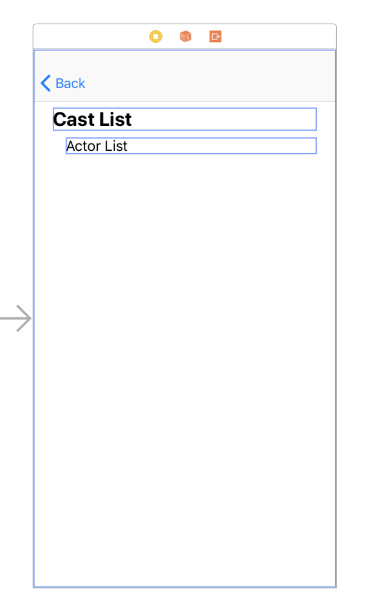</li>
</ul>

<br><br>
</details>
<br>

<details><summary>Step 4-5: Creating the Segue</summary>
<br><br>

4. Create a segue between <code>MovieTableviewCell</code> and <code>MovieCastDetailViewController</code>, though instead of chosing a segue of type "Selection Segue" you'll be using "Accessory Action" (but you're still using the <em>Push</em> type). Give the segue and identifier of <code>MovieCastDetailSegue</code>

<ul>
<li>
Creating the segue of type "Accessory Action" should automatically add a Disclosure Indicator accessory view to the <code>MovieTableviewCell</code>, but be sure to switch it to "Detail"
</li>

<li>
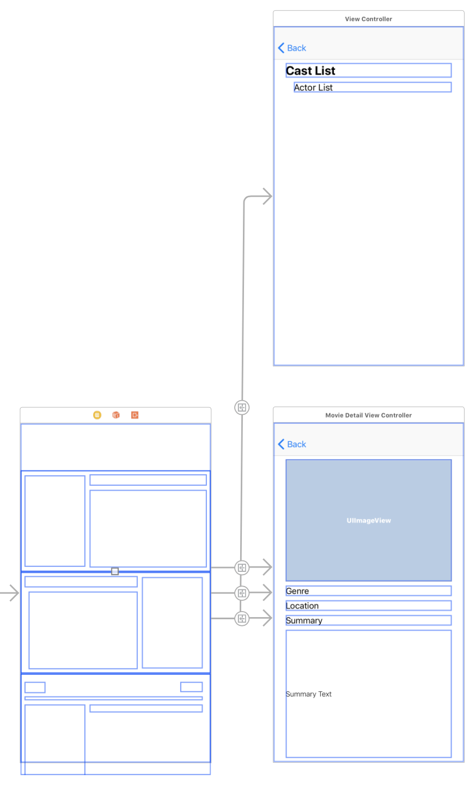
</li>
</ul>

5. Update your code in <code>MovieTableViewController.prepare(for:sender:)</code> to recognize the new segue identifier

<br><br>
</details>
<br>

<details><summary>Step 6: Populating the View Controller</summary>
<br><br>
6. Populate your <code>castListLabel</code> with the <code>Actor</code> names so that your final product looks like

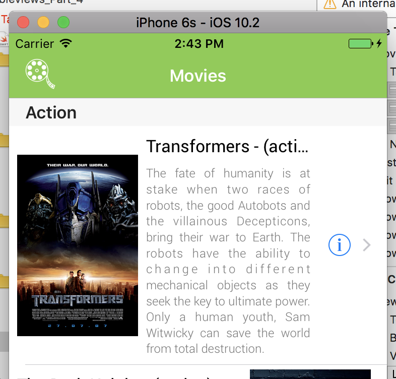
<br>
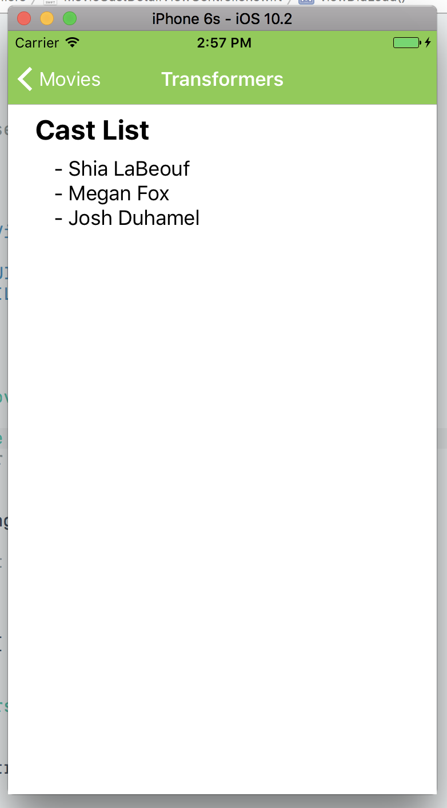

<br>
</details>
<br>

#### Advanced: More Custom VCs

Wouldn't it be nice if we'd get a different view controller based on whether we tapped on a `MovieTableViewCell`, `MovieRightAlignedTableViewCell` or `Alt1TableViewCell`? For this exercise, create two more `UIViewController` subclasses, one that will be the detail view controller for tapping on a `MovieRightAlignedTableViewCell` and the other for tapping on a `Alt1TableViewCell`.

Feel free to experiment with layout and design as you see fit, but make sure that:

1. You can segue properly to the corresponding view controller
2. The view controller's UI elements are populated correctly
3. There are no warnings or errors in your storyboard for each of the view controllers


#### Advanced: Using UITextView

You may have noticed that some of the labels get hidden when viewing the project on an iPhone 5s. Swap the `summaryText` `UILabel` with a `UITextView` to allow for this portion of the text to be scrollable. Then under “behavior” in attributes, uncheck both `Editable` and `Selectable`.
